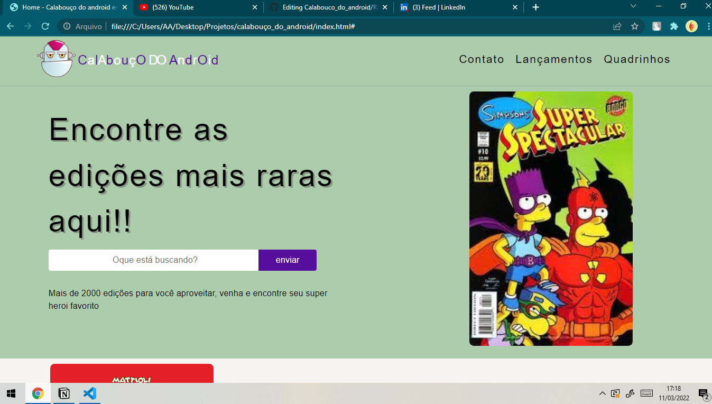

# Calabouco_do_android
O principal objetivo deese projeto foi desenvolver a home do que seria um ecommerce da loja

Este projeto foi inspirado loja do "cara dos quadrinhos" da serie Simpsons :
- A logo foi retirada do perfil do twitter @calandroid, fica aqui meus creditos
- As outras fotos, imagens e cores foram retiradas diretamente da serie

### Tecnologias Utilizadas
- HTML
- CSS
- jQuery

Abaixo a foto da "loja" na qual me inspirei para criar o site

Abaixo uma previa de como ficou o projeto, para ver com mais detalhes visualize o projeto:

